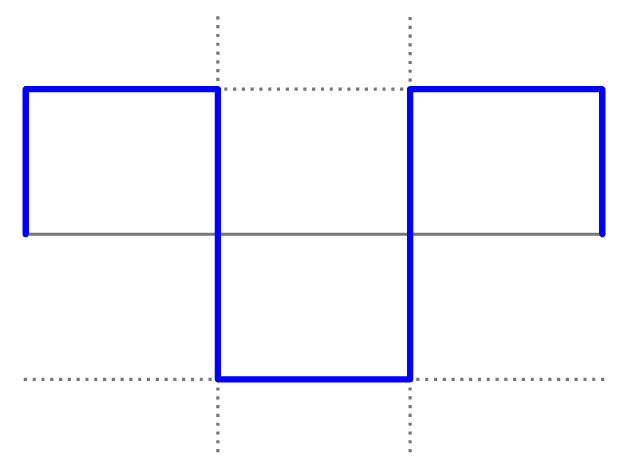

[Назад в оглавление](../../README.md)
# Генератор меандра



Данный пример генерирует звуковой сигнал прямоугольной формы с частотой 440 Гц.

Пример генератора меандра находится в папке `audio_synth_practice/1_wave_generators/1_square`

## Запуск примера
Чтобы запустить пример, выполните в консоли Modelsim/Questa:
```
cd audio_synth_practice/1_wave_generators/1_square
do make.do
```

или выберите в Vivado `tb_audio_square` как Top Level.

## Описание примера

Генератор меандра состоит из следующих частей:
- Счетчик частоты
- Счетчик меандра

### Счётчик частоты

Счётчик частоты используется во всех представленных на данном занятии модулях, поэтому будет разобран тут и далее ему внимание уделяться не будет.

```verilog
  // Frequency counter
  localparam FREQ_CNT_WIDTH = 19;

  logic [FREQ_CNT_WIDTH-1:0] freq_counter_ff;
  logic [FREQ_CNT_WIDTH-1:0] freq_counter_next;

  assign freq_counter_next = freq_counter_ff + freq_i;

  always_ff @(posedge clk_i or negedge rstn_i) begin
    if (~rstn_i)
      freq_counter_ff <= '0;
    else
      freq_counter_ff <= freq_counter_next;
  end

  logic freq_msb_dly_ff;

  always_ff @(posedge clk_i or negedge rstn_i) begin
    if (~rstn_i)
      freq_msb_dly_ff <= '0;
    else
      freq_msb_dly_ff <= freq_counter_ff[FREQ_CNT_WIDTH-1];
  end

  logic freq_ofl;
  assign freq_ofl = ~freq_counter_ff[FREQ_CNT_WIDTH-1] & freq_msb_dly_ff;
```

Суть этого счётчика заключается в следующем:
- Каждый такт мы прибавляем к регистру `freq_counter_ff` значение из входного порта `freq_i`
- В какой-то момент счётчик переполнится, и мы отслеживаем этот момент (сигнал `freq_ofl`)
- `freq_ofl` используется далее в качестве enable для всей логики, генерирующей звуковые сигналы
- Таким образом, чем выше значение `freq_i`, тем быстрее нарастает значение `freq_counter_ff` и быстрее этот регистр переполняется. Чем быстрее переполняется регистр, тем чаще генерируется новое состояние звукового сигнала
- Итог: `freq_i` позволяет управлять частотой генерируемого звука

### Счётчик меандра

```verilog
  // Square signal generation
  logic [7:0] square_ff;

  always_ff @(posedge clk_i or negedge rstn_i) begin
    if (~rstn_i)
      square_ff <= '0;
    else if (freq_ofl)
      square_ff <= square_ff + 1;
  end

  // Square counter MSB is used as actual output
  assign sample_data_o = {8{square_ff[7]}};
```

Счётчик меандра представляет из себя обычный 8-бит счетчик, при этом в качестве выхода меандра используется только его старший бит. Такое несколько странное решение сделано с целью добиться одинакового соотношения `freq_i` к реальной частоте звука во всех генераторах.
Значение `freq_i` для требуемой частоты звука F вычисляется по следующей формуле:

```
freq_i=round((2^27*F)/12500000)-1
```

> Например, для ноты Ля первой октавы (440 Гц) `freq_i` = 4723.
