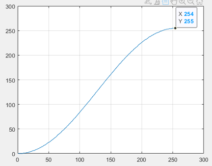
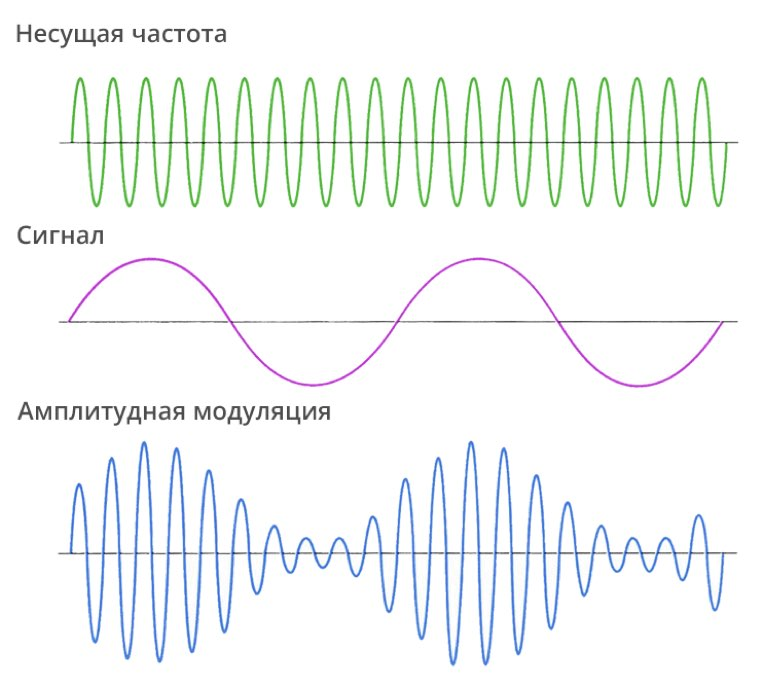

# Цифровой звук - практическое занятие

## Часть 0. Структура testbench и основная информация
Суть практической части занятия заключается в изучении примеров генерации звука. Практическая часть выполняется в симуляторе Modelsim/Questa. Предложенный testbench генерирует .wav файлы со звуком, позволяя Вам услышать звук на своём компьютере, не используя отладочные стенды с FPGA.
В используемом на данном занятии testbench можно выделить следующие секции:
- Функции write_wav_number и write_wav – предназначены для записи wav файла
- Генерация опорной тактовой частоты 12.5 МГц, используемой во всех генераторах звука
- Генерация сброса
- Initial-блок c последовательностью действий и нот
- Логика, имитирующая работу АЦП с частотой 48 КГц. Эта логика захватывает выход генераторов и, используя SystemVerilog Queue, сохраняет звуковые отчеты для вывода в wav файл.

## Часть 1. Простые генераторы звука
### Генератор меандра


Генератор меандра находится в папке `audio_synth_practice/1_wave_generators/1_square`


Чтобы запустить тестбенч, выполните в консоли Modelsim:
```
cd audio_synth_practice/1_wave_generators/1_square
do make.do
```

Генератор меандра состоит из следующих частей:
- Счетчик частоты
- Счетчик меандра

Счётчик частоты используется во всех представленных на данном занятии модулях, поэтому будет разобран тут и далее ему внимание уделяться не будет.
Суть этого счётчика заключается в следующем:
- Каждый такт мы прибавляем к регистру `freq_counter_ff` значение из входного порта `freq_i`
- В какой-то момент счётчик переполнится, и мы отслеживаем этот момент (сигнал `freq_ofl`)
- `freq_ofl` используется далее в качестве enable для всей логики, генерирующей звуковые сигналы
- Таким образом, чем выше значение `freq_i`, тем быстрее нарастает значение `freq_counter_ff` и быстрее этот регистр переполняется. Чем быстрее переполняется регистр, тем чаще генерируется новое состояние звукового сигнала
- Итог: `freq_i` позволяет управлять частотой генерируемого звука


Счётчик меандра представляет из себя обычный 8-бит счетчик, при этом в качестве выхода меандра используется только его старший бит. Такое несколько странное решение сделано с целью добиться одинакового соотношения `freq_i` к реальной частоте звука во всех генераторах.
Значение `freq_i` для требуемой частоты звука F вычисляется по следующей формуле:

```
freq_i=round((2^27*F)/12500000)-1
```

> Например, для ноты Ля первой октавы (440 Гц) `freq_i` = 4723.

### Генератор сигнала пилообразной формы


Генератор сигнала пилообразной формы находится в папке `audio_synth_practice/1_wave_generators/2_saw`.

Чтобы запустить тестбенч, выполните в консоли Modelsim:
```
cd audio_synth_practice/1_wave_generators/2_saw
do make.do
```
Генератор сигнала пилообразной формы отличается от генератора меандра только тем, что регистр (счётчик меандра) заведён на звуковой выход полностью, а не только в виде старшего бита.

### Генератор сигнала обратной пилообразной формы


Генератор сигнала пилообразной формы находится в папке `audio_synth_practice/1_wave_generators/3_saw_inv`.

Чтобы запустить тестбенч, выполните в консоли Modelsim:
```
cd audio_synth_practice/1_wave_generators/3_saw_inv
do make.do
```

Генератор сигнала обратной пилообразной формы отличается от генератора пилы только отрицательным направлением счёта регистра `saw_inv_ff`.

### Генератор сигнала треугольной формы


Генератор сигнала треугольной формы находится в папке `audio_synth_practice/1_wave_generators/4_triangle`.

Чтобы запустить тестбенч, выполните в консоли Modelsim:
```
cd audio_synth_practice/1_wave_generators/4_triangle
do make.do
```

Данный генератор содержит в себе логику пилы и обратной пилы, а также регистр `saw_select_ff`, управляющий переключением между двумя пилами. Таким образом, для формирования треугольника мы используем нарастающую часть обычный пилы и нисходящую часть обратной пилы.
Важно отметить, что длина сигнала треугольной формы при таком подходе получается равной 512 отчетам. Для того, чтобы частота совпадала с другими генераторами, нам необходимо с помощью сдвига влево умножить значение `freq_i` на два.

### Генератор сигнала синусоидальной формы
Генератор сигнала синусоидальной формы находится в папке `audio_synth_practice/1_wave_generators/5_sine`.

Чтобы запустить тестбенч, выполните в консоли Modelsim:
```
cd audio_synth_practice/1_wave_generators/5_sine
do make.do
```

Представленный генератор сигнала синусоидальной формы построен на табличном синусе и использует одну хитрость. Синус обладает симметрией, поэтому мы можем хранить только половину таблицы синуса и использовать нарастающую, а затем убывающую индексацию такой половинной таблицы. К счастью, у нас уже есть модуль, который способен сгенерировать такую индексацию – генератор треугольного сигнала. Его мы и используем, подключая выход генератора треугольного сигнала как индекс таблицы синуса.
Графическое представление табличного синуса представлено на изображении.



При моделировании не забудьте, что вам также необходим файл `sine_table_256.mem`!
 
### Генератор псевдослучайного шума
Генератор псевдослучайного шума находится в папке `audio_synth_practice/1_wave_generators/6_noise`.

Чтобы запустить тестбенч, выполните в консоли Modelsim:
```
cd audio_synth_practice/1_wave_generators/6_noise
do make.do
```

Генератор псевдослучайного шума построен по принципу сдвигового регистра с линейной обратной связью.
Алгоритм его работы можно описать следующим листингом на языке Си:

```c
/* Test a bit. Returns 1 if bit is set. */
long bit(long val, byte bitnr) {
  return (val & (1<<bitnr))? 1:0;
}


/* Generate output from noise-waveform */
void Noisewaveform {
  long bit22;	/* Temp. to keep bit 22 */
  long bit17;	/* Temp. to keep bit 17 */

  long reg= 0x7ffff8; /* Initial value of internal register*/

  /* Repeat forever */
  for (;;;) {

    /* Pick out bits to make output value */
    output = (bit(reg,22) << 7) |
	     (bit(reg,20) << 6) |
	     (bit(reg,16) << 5) |
	     (bit(reg,13) << 4) |
	     (bit(reg,11) << 3) |
	     (bit(reg, 7) << 2) |
	     (bit(reg, 4) << 1) |
	     (bit(reg, 2) << 0);

    /* Save bits used to feed bit 0 */
    bit22= bit(reg,22);
    bit17= bit(reg,17);

    /* Shift 1 bit left */
    reg= reg << 1;

    /(* Feed bit 0 */
    reg= reg | (bit22 ^ bit17);
  };
};
```

> Интересный факт заключается в том, что представленный генератор шума является полной копией генератора шума из микросхемы SID, структура генератора была получена в результате реверс-инжиниринга (http://www.sidmusic.org/sid/sidtech5.html). 

Также стоит отметить неочевидный момент: выдаваемый генератором шума звук меняется при изменении частоты `freq_i`, так как меняется спектр шума.

## Часть 2. Звуковой канал
Звуковой канал находится в папке `audio_synth_practice/2_audio_channel`.

Чтобы запустить тестбенч, выполните в консоли Modelsim:
```
cd audio_synth_practice/2_audio_channel
do make.do
```

Звуковой канал представляет из себя объединение всех генераторов звука из первой части с логикой их выбора и логикой управления громкостью (реализована с использованием умножения).

Тестбенч содержит последовательность, в которой все генераторы звукового канала переключаются каждую секунду.

## Часть 3. Проигрывание простой музыки на звуковом канале
Демонстрация проигрывания простой музыки на звуковом канале находится в папке `audio_synth_practice/3_music`.

Чтобы запустить тестбенч, выполните в консоли Modelsim:
```
cd audio_synth_practice/3_music
do make.do
```
Тестбенч содержит управляющую последовательность, генерирующую простую музыку на одном звуковом канале.

## Часть 4. Проигрывание простой музыки на двух звуковых каналах
Демонстрация проигрывания простой музыки на звуковом канале находится в папке `audio_synth_practice/4_music_multichannel`.

Чтобы запустить тестбенч, выполните в консоли Modelsim:
```
cd audio_synth_practice/4_music_multichannel
do make.do
```

Эта демонстрация добавляет к части 3 второй звуковой канал и простое микширование между двумя каналами.
Тестбенч построен так, что на обоих каналах играются одинаковые ноты, но разными генераторами, с целью получения более «интересного» звука.
 
## Часть 5. Модуляция
### Частотная модуляция


Демонстрация частотной модуляции находится в папке `audio_synth_practice/5_modulation/1_frequency_modulation`.

Чтобы запустить тестбенч, выполните в консоли Modelsim:
```
cd audio_synth_practice/5_modulation/1_frequency_modulation
do make.do
```

В показанном примере частота генератора синусоидального сигнала модулируется выходом из генератора сигнала треугольной формы. В результате получается интересный звуковой эффект.

### Амплитудная модуляция



Демонстрация амплитудной модуляции находится в папке `audio_synth_practice/5_modulation/ 2_amplitude_modulation`.

Чтобы запустить тестбенч, выполните в консоли Modelsim:
```
cd audio_synth_practice/5_modulation/2_amplitude_modulation
do make.do
```

В показанном примере громкость генератора синусоидального сигнала модулируется выходом из генератора сигнала треугольной формы. В результате получается интересный звуковой эффект.

## Часть 6. Проигрывание сэмплов


Демонстрация проигрывания сэмплов находится в папке `audio_synth_practice/ 6_samples`.

Чтобы запустить тестбенч, выполните в консоли Modelsim:
```
cd audio_synth_practice/6_samples
do make.do
```

Для корректного однократного проигрывания сэмпла используется внутренний автомат состояний, состояние которого хранится в `sample_actv_ff`.
При получении строба `en_i` генератор безусловно начинает исполнять сэмпл сначала (даже если при получении `en_i` уже велось исполнение сэмпла). При окончании исполнения `sample_actv_ff` сбрасывается в «0» и канал сэмпла уходит в состояние бездействия.
В демонстрации с помощью одного семпла проигрывается узнаваемое с пары нот вступление песни «Smoke on the water» группы Deep Purple. Мы пользуемся тем, что на самом деле это вступление состоит из одного аккорда, просто на разных частотах.
